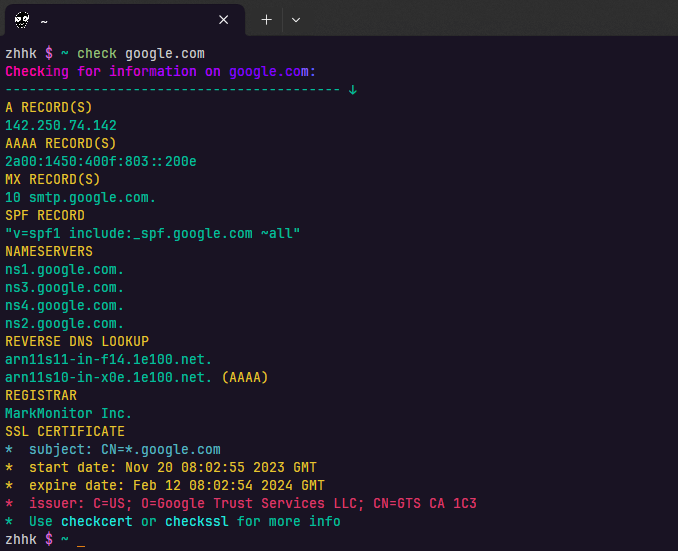

## **About this tool**
Usage: ```check domain.tld``` to lookup relevant DNS, WHOIS and SSL information in your terminal.



## **Installation and setup**
| * | Copy-paste this!                                     | "But to where you ask"                        |
| :-| :----------------------------------------------------|:----------------------------------------------|
| 1 | ```export PATH="check:$PATH"```                      | Add to your .zshrc or equivalent.             |
| 2 | ```source ~/check/check_function.zsh```              | Add to your .zshrc or equivalent.             |
| 3 | ```alias uc='update_check.sh'```                     | (Optional) set an alias for the update script |
| 4 | ```git clone https://github.com/zhk3r/check.git```   | to clone this repo.                           |
| 5 | ```chmod +x ~/check/update_check.sh```               | to make the update script run.                |
| 6 | ```source .zshrc```                                  | or equivalent (restart terminal)              |

You should be good to go!

### Updating the script
After updating the script you will have to either, 

1) ```source .zshrc``` (or equivalent).
2) Restart your terminal.
3) Open up a new terminal tab.

## **Preliminary checks before actually starting the script** 
1) Checks for 'NXDOMAIN' status in the header-information.
2) Checks whether or not the domain SOA beings with 'charm.norid.no' e.g *[quarantine]*
   
- If the domain has the 'NXDOMAIN' status the script will inform about it and stop. 
- If the domain SOA matches 'charm.norid.no' the script will inform about it and stop. 

## **Domain information**
The script will look for the following information on the given domain:


| WHAT      | WHICH     | EXPLANATION                                   |
| :---------|:----------|:----------------------------------------------|
| RECORD    | A         | Looks up any A records                        |
| RECORD    | AAAA      | Looks up any AAAA records                     |
| FORWARD   | HTTP      | Checks for http_status-based forwarding       |        
| FORWARD   | redir     | Checks for _redir forwarding                  |
| FORWARD   | parked    | Checks for parked messages                    |
| RECORD    | MX        | Looks up Mail Exchange records.               |
| RECORD    | SPF       | Searches for SPF records in TXT + SPF         |   
| RECORD    | NS        | Nameservers                                   | 
| DNSLOOKUP | REVERSE   | Reverse DNS lookup on both A & AAAA records   |         
| WHOIS     | REGISTRAR | WHOIS and pull registrar name                 |
| CURL      | SSL CERT  | Check SSL certificate status                  |

  ### Secondary functions
  ```checkcert``` can be used to display a bit more information about the SSL certificate.

   ```checkssl``` can be used to connect to the hostname using ```openssl``` protocol, displaying the certificate chain.

## **Output and sanitazion of information**

There are some hidden checks that happen during some of the checks, these include but are possibly not limited to:

Some of the functions sanitize the output in order to show only relevant information. Some of these checks includes the WHOIS lookup which accounts for a subdomain being input, WHOIS lookup where a secondary lookup is done if special paramaters are met. The reverse DNS lookup part also has rules that sanitizes the information if the result isn't relevant (in.addr.rpa, SOA).

### **Dependencies**

- dig
- whois
- openssl
- curl
- lolcat *(not strictly necessary, you can remove* ```| lolcat``` *from line 59)*
